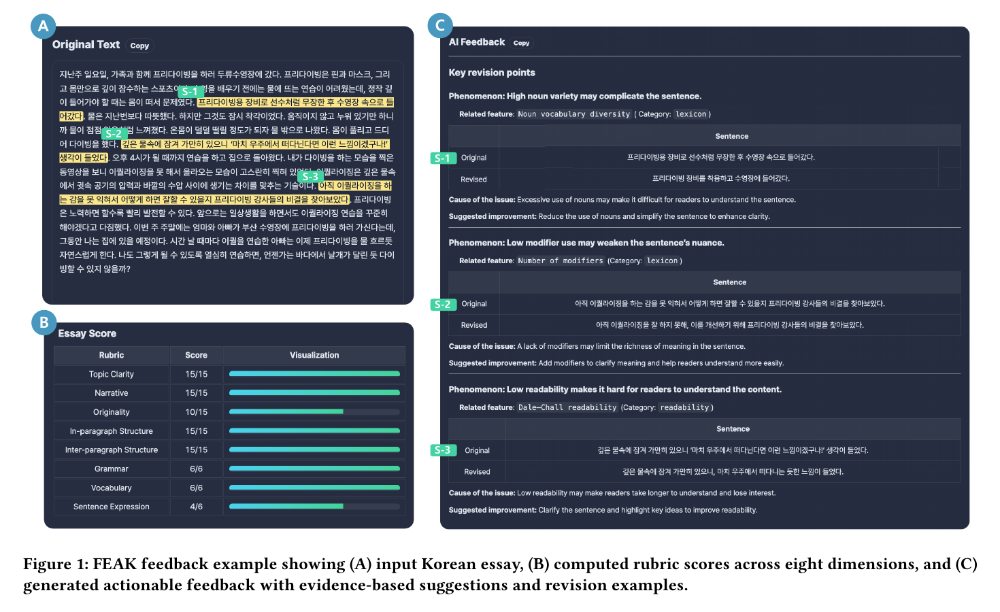
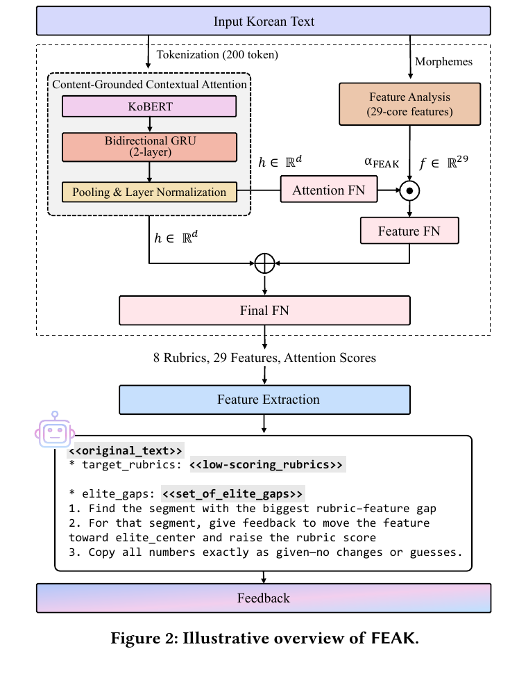
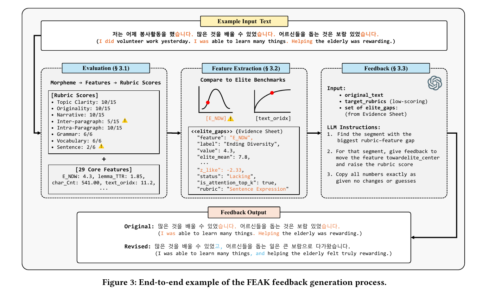

# FEAK

## Feature-based Evaluation and AI feedback for Korean writing

ACM/SIGAPP SAC 2026 AIED (Oral) | [Paper](docs/SAC26_AIED_for_arXiv.pdf) | [DOI](https://doi.org/10.1145/3748522.3780021)

## Enhanced Automated Writing Evaluation

### Objective

- Produce reliable diagnostic signals for downstream feedback generation
- Jointly model essay semantics and interpretable linguistic measurements
- Improve scoring over the UKTA baseline without discarding feature-level evidence

### Approach

- Encode up to 200 tokens with KoBERT and a two-layer bidirectional GRU
- Apply mean pooling and layer normalization to obtain the essay representation
- Compute 29 core linguistic features from morphologically analyzed Korean text
- Use Content-Grounded Contextual Attention to assign essay-specific weights to the 29 features
- Concatenate the semantic representation with the weighted feature representation to predict eight rubric scores:
  - Topic Clarity, Narrative, Originality
  - Intra-paragraph Structure, Inter-paragraph Structure
  - Grammar, Vocabulary, Sentence Expression

## Diagnostic-based Feature Extraction

### Objective

- Select a compact set of high-impact evidence instead of passing all available measurements to the LLM
- Prioritize features that are both statistically deficient and contextually salient for the current essay
- Make every selected signal traceable to a rubric, a measured value, and an elite benchmark

### Approach

- Reduce 294 candidate features to 29 core features using five complementary procedures:
  - Pearson/Spearman correlation significance
  - OLS significance with VIF filtering and HC3-robust errors
  - Stable Lasso selection
  - Mutual information
  - Permutation importance
- Build elite reference distributions from the top 10% of high-scoring essays
- Identify the two lowest-scoring rubrics for each input essay
- Standardize each feature gap against the elite mean and standard deviation
- Rank features using gap magnitude, contextual attention, and decile-based improvement status
- Select up to six rubric-balanced features and serialize them as an evidence sheet

## Evidence-based Feedback Generation

### Objective

- Constrain the LLM to translate quantitative diagnosis into feedback rather than independently evaluate the essay
- Prevent generic or unsupported suggestions caused by information overload
- Generate feedback whose claims can be audited against measured evidence

### Approach

- Provide the LLM with only the original essay, two weak rubrics, and six selected feature gaps
- Require the model to locate the sentence segment with the largest rubric-feature gap
- Constrain every numerical claim to values copied from the evidence sheet
- Generate a three-part response for each issue:
  - **Phenomenon**: what is wrong and why it matters
  - **Evidence**: which sentence exhibits the issue
  - **Revision**: a concrete before-and-after example

## Experimental Results

### Feedback Quality and Efficiency

The user study included 21 undergraduate participants assigned to Expert, general-purpose LLM, and FEAK feedback conditions.

| Condition | Draft | Revision | Improvement | Generation time |
|:--|--:|--:|--:|--:|
| Expert | 70.00 | 75.43 | +5.43 | 471.20 s |
| General-purpose LLM | 68.14 | 70.29 | +2.14 | 8.78 s |
| **FEAK** | **67.43** | **71.86** | **+4.43** | **16.42 s** |

- FEAK was not significantly different from expert feedback in writing improvement (`p = .231`).
- FEAK significantly outperformed the general-purpose LLM condition (`p = .028`).
- FEAK generated feedback approximately 25 times faster than human experts.

### Analyzer Performance

The Analyzer was trained on 40,000 essays and tested on 6,000 essays from the AI-Hub Essay Evaluation Dataset.

| Model | Accuracy | QWK |
|:--|--:|--:|
| UKTA baseline | 0.642 | 0.474 |
| **FEAK Analyzer** | **0.655** | **0.521** |

The enhanced Analyzer improved Accuracy on six of eight rubrics and QWK on six of eight rubrics, with overall gains of **+1.3 percentage points in Accuracy** and **+4.7 percentage points in QWK**.
