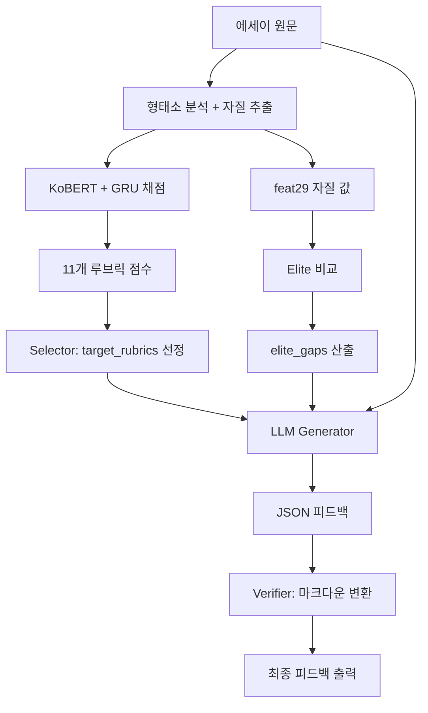

# UKTA 에세이 채점 루브릭 - LLM 컨텍스트 가이드

## 📋 개요

UKTA(Universal Korean Text Analyzer)는 한국어 에세이를 11개 루브릭으로 자동 채점하고, AI 기반 피드백을 생성하는 시스템입니다. 본 문서는 외부 LLM 모델이 루브릭 정보를 이해하고 맥락에 맞는 피드백을 생성할 수 있도록 구조화된 정보를 제공합니다.

---

## 🎯 11개 평가 루브릭 (Rubrics)

### 📌 전체 루브릭 목록

| 영문 키 | 한글명 | 카테고리 | 만점 | 가중치 | 설명 |
|---------|--------|----------|------|--------|------|
| `grammar` | 문법 | 표현 | 6점 | 2배 | 문법적 정확성, 맞춤법, 조사/어미 사용의 적절성 |
| `vocabulary` | 어휘 | 표현 | 6점 | 2배 | 어휘 선택의 적절성, 다양성, 수준별 사고도구어 사용 |
| `sentence_expression` | 문장 표현 | 표현 | 6점 | 2배 | 문장 구성력, 표현의 명확성, 문체 일관성 |
| `intra_paragraph_structure` | 문단 내 구조 | 조직 | 15점 | 5배 | 문단 내부의 논리적 흐름, 문장 간 연결성 |
| `inter_paragraph_structure` | 문단 간 구조 | 조직 | 15점 | 5배 | 문단 간 전개 순서, 논리적 연결, 응집성 |
| `structural_consistency` | 구조적 일관성 | 조직 | - | - | 전체 구조의 일관성 (현재 피드백 대상 제외) |
| `length` | 길이 | 기본 | - | - | 에세이 분량 적절성 (현재 피드백 대상 제외) |
| `topic_clarity` | 주제 명확성 | 내용 | 15점 | 5배 | 주제 제시의 명확성, 주제 일관성 유지 |
| `originality` | 독창성 | 내용 | 15점 | 5배 | 참신한 관점, 창의적 사고, 차별화된 내용 |
| `prompt_comprehension` | 프롬프트 이해도 | 내용 | - | - | 과제 요구사항 이해 및 충족 (현재 피드백 대상 제외) |
| `narrative` | 서사/전개 | 내용 | 15점 | 5배 | 내용 전개의 논리성, 스토리텔링 역량 |

---

## 🔍 채점 시스템 상세

### 1. 채점 모델 아키텍처

```
입력 에세이 텍스트
    ↓
형태소 분석 + 자질 추출 (29개 언어학적 자질)
    ↓
KoBERT (Contextualized Embedding)
    ↓
GRU + UKTA Attention (29개 자질 가중 통합)
    ↓
11개 루브릭 점수 (0~6 또는 0~15)
```

**핵심 컴포넌트:**
- **KoBERT**: 한국어 BERT 모델로 텍스트 임베딩 생성
- **GRU with Layer Normalization**: 양방향 GRU로 시퀀스 정보 처리
- **UKTA Attention**: 29개 자질에 대한 동적 가중치 학습
- **출력**: Sigmoid 활성화로 0~1 범위 점수 → 스케일링

### 2. 채점 범위 및 가중치

**표현 영역 (가중치 2배):**
- `grammar`, `vocabulary`, `sentence_expression`
- 0~6점 → 조정 점수 0~12점
- 언어적 정확성과 표현력 평가

**조직 영역 (가중치 5배):**
- `intra_paragraph_structure`, `inter_paragraph_structure`
- 0~15점 → 조정 점수 0~75점
- 구조적 완성도 평가

**내용 영역 (가중치 5배):**
- `topic_clarity`, `originality`, `narrative`
- 0~15점 → 조정 점수 0~75점
- 내용의 질과 독창성 평가

---

## 📊 29개 언어학적 자질 (feat29)

### 자질 카테고리

채점 모델은 다음과 같은 언어학적 자질을 기반으로 학습됩니다:

**1. 기본 통계 자질**
- 문장/문단 수, 평균 길이, 단어/형태소 밀도
- 예: `avg_sentence_length`, `num_paragraphs`, `morpheme_density`

**2. 어휘 다양성 자질**
- TTR (Type-Token Ratio), NDW (Number of Different Words)
- 사고도구어 등급별 비율 (grade_2_ratio, grade_3_ratio, grade_4_ratio)
- 예: `lexical_diversity_ttr`, `vocabulary_richness`

**3. 문장 복잡도 자질**
- 절/구 구조 복잡도, 종속절 비율
- 예: `syntactic_complexity`, `clause_density`

**4. 응집성 자질**
- 참조 응집성 (지시어, 접속어 사용)
- 문장 간 의미 유사도
- 예: `cohesion_score`, `semantic_similarity_avg`

**5. 반복/정형 표현 자질**
- 어휘 반복률, 정형 표현 사용 빈도
- 예: `repetition_rate`, `formulaic_expression_ratio`

**6. 이독성 자질**
- Flesch Reading Ease 등 이독성 점수
- 예: `readability_score`

**중요:** 각 자질은 우수 에세이 집단(elite)의 분포와 비교하여 "부족/적정/과다" 판단

---

## 🎓 AI 피드백 생성 시스템

### 1. Selector 단계 (서버)

**목적:** 개선이 필요한 루브릭 및 자질 선정

**입력:**
- `rubric_scores`: 11개 루브릭 점수
- `feat29`: 29개 자질 값
- `top_k_features`: 채점 모델이 선정한 중요 자질 (선택)

**처리 과정:**

```python
# 1) 개선 필요 루브릭 2개 선정
target_rubrics = select_two_lowest_rubrics(rubric_scores)
# → 8개 피드백 대상 루브릭 중 점수가 낮은 2개

# 2) Elite 비교 통한 자질 gap 분석
elite_gaps = compare_with_topk_hint(feat29, top_k_features, top_k=6)
# → 우수 에세이와 비교하여 차이가 큰 자질 6개 추출
```

**출력 (`elite_gaps` 예시):**
```json
[
  {
    "feature": "avg_sentence_length",
    "label_ko": "평균 문장 길이",
    "desc_ko_llm": "한 문장의 평균 어절 수. 적절한 길이는 가독성을 높입니다.",
    "value": 12.5,              // 현재 값
    "elite_center": 18.3,        // 우수 에세이 평균
    "z_like": -1.45,             // 표준편차 기준 차이
    "direction": "higher_is_better",
    "status": "부족",             // 부족/적정/과다
    "suggest": "↑ 늘리기",
    "strength": "강권고",         // 참고/약권고/강권고
    "score": 1.65,               // 우선순위 점수
    "is_hint": true              // top_k에 포함 여부
  },
  // ... 5개 더
]
```

**피드백 대상 루브릭 (8개):**
```python
RUBRIC_KEYS = [
    "topic_clarity",              # 주제 명확성
    "narrative",                  # 서사/전개
    "originality",                # 독창성
    "intra_paragraph_structure",  # 문단 내 구조
    "inter_paragraph_structure",  # 문단 간 구조
    "grammar",                    # 문법
    "vocabulary",                 # 어휘
    "sentence_expression",        # 문장 표현
]
```

**제외 루브릭 (3개):**
- `structural_consistency`: 구조적 일관성 (현재 피드백 미제공)
- `length`: 길이 (정량적 평가만 수행)
- `prompt_comprehension`: 프롬프트 이해도 (자동 평가 어려움)

### 2. Generator 단계 (LLM)

**LLM 역할:** JSON 구조화된 피드백 생성

**프롬프트 구조:**
```
너는 국어학 기반 한국어 글쓰기 컨설턴트다.
오직 JSON만 출력한다(마크다운/서문/코드블록 금지).

[입력 데이터]
- target_rubrics: ["grammar", "vocabulary"]
- elite_gaps: [위의 6개 자질 정보]
- original_text: "에세이 원문..."

[출력 JSON 구조]
{
  "summary": "전체 요약",
  "issues": [
    {
      "rubric": "grammar",
      "type": "lexicon|morphology|syntax|cohesion|discourse|readability",
      "phenomenon": "구체적 문제 현상",
      "metric_link": "avg_sentence_length",  // elite_gaps의 feature
      "metric_current": 12.5,
      "metric_target": 18.3,
      "evidence": {
        "sent_idx": 3,              // 0-based 문장 인덱스
        "span": "문제가 되는 원문 구절"
      },
      "why": "문제 원인 설명",
      "suggestion": "구체적 개선 방안",
      "expected_effect": "개선 시 기대 효과"
    }
  ],
  "action_plan": ["단계별 개선 계획"],
  "sample_edits": [
    {
      "metric_link": "avg_sentence_length",
      "sent_idx": 3,
      "before": "원문 그대로",
      "after": "수정안",
      "edit_ops": ["치환", "삽입"]
    }
  ],
  "reasoning_brief": ["간결한 근거"],
  "one_liner": "20자 내외 한 줄 요약"
}
```

**LLM 설정:**
- **모델:** `gpt-4o-mini` (기본)
- **Temperature:** `0.2` (일관성 우선)
- **System Prompt:** "오직 JSON만 출력, 코드펜스/서문/마크다운 금지"

**핵심 제약사항:**
1. **metric_link 필수:** 모든 issue는 `elite_gaps[].feature` 중 하나와 연결
2. **증거 명시:** `evidence.sent_idx`, `evidence.span`으로 원문 지점 특정
3. **구체성:** "자연스럽게", "어색함", "좀 더" 같은 모호어 사용 금지
4. **다양성:** 최소 4개 issue, 최소 3개 이상의 서로 다른 metric_link 사용
5. **원문 보존:** 불필요한 재창작 금지, 화법과 정보 유지

### 3. Verifier 단계 (서버)

**목적:** LLM 출력을 마크다운으로 변환

**처리:**
```python
def create_verifier_prompt(original_text, draft_json_str):
    # JSON 파싱 → 마크다운 조립 (LLM 재호출 없음!)
    data = json.loads(draft_json_str)

    # 마크다운 템플릿:
    """
    ## 📝 요약
    {summary}

    ## 🔍 핵심 이슈
    ### 🧐 현상: {phenomenon}
    * 관련 평가항목: {rubric} (유형: {type})
    * 관련 지표: {metric_link} ({metric_current} → {metric_target} 목표)
    * 문제 지점: 문장 #{sent_idx}, "{span}"
    > 문제 원인: {why}
    > 개선 제안: {suggestion}
    > 기대 효과: {expected_effect}

    ## 📋 수정 지침
    {action_plan[]}

    ## ✍️ 샘플 문장 수정
    [관련 지표: {metric_link}] (문장 #{sent_idx})
    > Before: {before}
    > After: {after}

    ## 💬 한 줄 요약
    {one_liner}
    """
```

**출력:** 프론트엔드 렌더링용 마크다운 문자열

---

## 🔧 LLM에게 제공할 핵심 컨텍스트

### 1. 루브릭별 평가 기준

**표현 영역 (Expression)**

**`grammar` - 문법 (0~6점)**
- **평가 요소:**
  - 맞춤법 정확성 (띄어쓰기, 철자)
  - 조사 사용의 적절성 (은/는, 이/가, 을/를 등)
  - 어미 활용 정확성 (-ㄴ다/-는다, -ㄹ/-을 등)
  - 문장 성분 간 호응 관계
- **피드백 방향:**
  - 문법 오류 지점 구체적 명시
  - 올바른 형태 제시
  - 문법 규칙 간단 설명

**`vocabulary` - 어휘 (0~6점)**
- **평가 요소:**
  - 어휘 선택의 적절성 (맥락에 맞는 단어 사용)
  - 어휘 다양성 (동일 단어 반복 회피)
  - 사고도구어 수준 (2~4수준 균형)
  - 전문 용어 vs 일상어 균형
- **관련 자질:**
  - `lexical_diversity_ttr`: Type-Token Ratio
  - `grade_2_ratio`, `grade_3_ratio`, `grade_4_ratio`: 등급별 어휘 비율
  - `vocabulary_richness`: 어휘 풍부도
- **피드백 방향:**
  - 단조로운 어휘 → 유의어/동의어 제안
  - 부적절한 어휘 → 맥락에 맞는 대체어
  - 반복 표현 → 다양한 표현 방식

**`sentence_expression` - 문장 표현 (0~6점)**
- **평가 요소:**
  - 문장 구성력 (주술 관계 명확성)
  - 표현의 명확성 (의미 전달력)
  - 문체 일관성 (존대법, 시제 통일)
  - 문장 길이의 적절성
- **관련 자질:**
  - `avg_sentence_length`: 평균 문장 길이
  - `syntactic_complexity`: 구문 복잡도
- **피드백 방향:**
  - 지나치게 긴 문장 → 분할 제안
  - 지나치게 짧은 문장 → 결합 또는 확장
  - 애매한 표현 → 명확화

**조직 영역 (Organization)**

**`intra_paragraph_structure` - 문단 내 구조 (0~15점)**
- **평가 요소:**
  - 문단 내 문장 간 논리적 순서
  - 주제문-뒷받침문-마무리문 구조
  - 문장 간 연결어 사용
  - 문단 내 일관성
- **관련 자질:**
  - `cohesion_score`: 응집성 점수
  - `semantic_similarity_avg`: 문장 간 의미 유사도
- **피드백 방향:**
  - 논리적 순서 재배치
  - 연결어 추가/수정
  - 중심 문장 명확화

**`inter_paragraph_structure` - 문단 간 구조 (0~15점)**
- **평가 요소:**
  - 문단 간 전개 순서의 논리성
  - 문단 간 전환의 자연스러움
  - 서론-본론-결론 구조
  - 문단 간 응집성
- **관련 자질:**
  - `num_paragraphs`: 문단 수
  - `paragraph_transition_quality`: 문단 전환 품질
- **피드백 방향:**
  - 문단 순서 재구성
  - 문단 간 연결어/전환 표현 추가
  - 각 문단의 역할 명확화

**내용 영역 (Content)**

**`topic_clarity` - 주제 명확성 (0~15점)**
- **평가 요소:**
  - 주제 제시의 명확성
  - 주제 일관성 유지
  - 주제에서 벗어나지 않음
  - 주제와 내용의 연관성
- **관련 자질:**
  - `topic_consistency_score`: 주제 일관성
  - `semantic_coherence`: 의미적 일관성
- **피드백 방향:**
  - 주제문 강화
  - 주제와 무관한 내용 제거
  - 주제 관련 키워드 일관성 확보

**`originality` - 독창성 (0~15점)**
- **평가 요소:**
  - 참신한 관점 제시
  - 창의적 사고
  - 차별화된 내용
  - 고정관념 탈피
- **관련 자질:**
  - `unique_vocabulary_ratio`: 독특한 어휘 비율
  - `creative_expression_score`: 창의적 표현 점수
- **피드백 방향:**
  - 독창적 관점 추가 제안
  - 뻔한 표현 → 참신한 표현
  - 사례/비유의 독창성 강화

**`narrative` - 서사/전개 (0~15점)**
- **평가 요소:**
  - 내용 전개의 논리성
  - 스토리텔링 역량
  - 기승전결 구조
  - 독자 몰입도
- **관련 자질:**
  - `narrative_flow_score`: 서사 흐름
  - `logical_progression`: 논리적 전개
- **피드백 방향:**
  - 전개 순서 개선
  - 논리적 비약 보완
  - 구체적 예시/근거 추가

### 2. 자질-루브릭 연결 가이드

**자질과 루브릭의 관계:**

| 자질 예시 | 주 영향 루브릭 | 부 영향 루브릭 |
|-----------|----------------|----------------|
| `avg_sentence_length` | sentence_expression | grammar, intra_paragraph_structure |
| `lexical_diversity_ttr` | vocabulary | sentence_expression |
| `grade_X_ratio` | vocabulary | topic_clarity, originality |
| `cohesion_score` | intra_paragraph_structure | inter_paragraph_structure |
| `semantic_similarity_avg` | topic_clarity | narrative |
| `syntactic_complexity` | sentence_expression | grammar |
| `repetition_rate` | vocabulary | sentence_expression |
| `paragraph_transition_quality` | inter_paragraph_structure | narrative |

**피드백 작성 시 유의사항:**

1. **구체성 우선:**
   - ❌ "문장이 어색합니다"
   - ✅ "주어와 서술어가 호응하지 않습니다: '학생들은 공부를 열심히 했다' → '학생들은 공부를 열심히 한다'"

2. **자질 기반 근거:**
   - ❌ "어휘가 단조롭습니다"
   - ✅ "어휘 다양도(TTR)가 0.45로 우수 집단(0.62)보다 낮습니다. '생각하다'가 15회 반복되므로 '고민하다', '숙고하다' 등으로 대체하세요"

3. **원문 보존:**
   - ❌ 전체 문장을 완전히 다시 작성
   - ✅ 최소한의 수정으로 문제 해결

4. **증거 명시:**
   - 모든 issue에 `evidence.sent_idx`, `evidence.span` 포함
   - 원문에서 정확한 위치 특정

---

## 📈 우수 에세이 기준 (Elite Standards)

### Elite 집단 정의
- **출처:** 고득점 에세이 데이터 집합
- **용도:** 학생 에세이와 비교하여 개선 방향 제시
- **통계:** 각 자질별 평균(mean), 표준편차(std), 백분위수(deciles)

### Direction 해석

**`higher_is_better`** (높을수록 좋음)
- 예: `lexical_diversity_ttr`, `vocabulary_richness`, `semantic_similarity_avg`
- 현재값 < elite_center → "부족" → "↑ 늘리기"

**`lower_is_better`** (낮을수록 좋음)
- 예: `repetition_rate`, `readability_difficulty_score`
- 현재값 > elite_center → "과다" → "↓ 줄이기"

**`balanced`** (중간이 좋음)
- 예: `avg_sentence_length` (너무 짧거나 길면 안 됨)
- p30 미만 → "부족", p70 초과 → "과다"

### Z-score 기반 강도

```
|z| < 0.5: "참고" (약한 차이)
0.5 ≤ |z| < 1.0: "약권고" (중간 차이)
1.0 ≤ |z|: "강권고" (큰 차이)
```

### Metric Target 설정

**higher_is_better:**
```python
metric_target = elite_center * 1.05  # 5% 여유
# 또는
metric_target = elite_center + (elite_center - metric_current) * 0.5
```

**lower_is_better:**
```python
metric_target = elite_center * 0.95  # 5% 여유
```

---

## 🎨 피드백 작성 Best Practices

### 1. Issue Type 분류

**`lexicon` (어휘):**
- 단어 선택, 어휘 수준, 반복, 동의어 사용

**`morphology` (형태):**
- 조사, 어미, 접사, 활용형

**`syntax` (구문):**
- 문장 구조, 호응, 어순, 복잡도

**`cohesion` (응집성):**
- 지시어, 접속어, 문장/문단 간 연결

**`discourse` (담화):**
- 주제 일관성, 논리적 전개, 서사 구조

**`readability` (가독성):**
- 문장 길이, 표현 명확성, 이해 난이도

### 2. Sample Edits 작성 규칙

**edit_ops 종류:**
- `치환`: 단어/구절 교체
- `삽입`: 내용 추가
- `삭제`: 불필요한 내용 제거
- `분할`: 긴 문장을 2개 이상으로 나누기
- `결합`: 짧은 문장 합치기
- `재배치`: 순서 변경

**예시:**
```json
{
  "metric_link": "avg_sentence_length",
  "sent_idx": 5,
  "before": "나는 학교에 갔고, 친구를 만났고, 점심을 먹었고, 공부를 하고, 집에 왔다.",
  "after": "나는 학교에 가서 친구를 만났다. 함께 점심을 먹은 후 공부를 하고 집에 왔다.",
  "edit_ops": ["분할", "치환"]
}
```

### 3. Action Plan 작성

**구조:**
```
1. [문장 번호] + [구체적 작업] (자질 유형)
2. [범위] + [수정 방법] + [기대 효과]
```

**예시:**
```
1. 문장 3에서 '초딩'을 '초등학생'으로 치환(lexicon), 동일 문단에서 동의어 1개 추가
2. 2문단 도입부에 전환 표현 '그러나' 삽입(cohesion), 1문단과의 논리적 연결 강화
3. 문장 7-9를 주제 관련성 순으로 재배치(discourse), 주제 일관성 개선
```

### 4. 금지어 목록

**모호한 표현:**
- "자연스럽게", "어색함", "좀 더", "조금", "약간"
- "전반적으로", "대체로", "어느 정도"
- "등등", "기타", "~하거나"

**대안:**
```
❌ "문장이 좀 더 자연스러워야 합니다"
✅ "주어 '학생들이'와 서술어 '공부했다'의 시제를 '공부한다'로 일치시키세요"

❌ "어휘가 전반적으로 단조롭습니다"
✅ "'생각하다'가 8회 반복됩니다. 3~5회는 '고민하다', '숙고하다'로 대체하세요"
```

---

## 🔄 워크플로우 전체 흐름



**각 단계별 데이터:**

1. **입력:** 에세이 원문
2. **자질 추출:** 29개 수치 자질
3. **채점:** 11개 루브릭 점수 (0~6 또는 0~15)
4. **Selector:**
   - `target_rubrics`: ["grammar", "vocabulary"] (예시)
   - `elite_gaps`: 6개 자질 상세 정보
5. **Generator (LLM):**
   - 입력: 원문 + target_rubrics + elite_gaps
   - 출력: JSON (issues, action_plan, sample_edits 등)
6. **Verifier:**
   - 입력: JSON
   - 출력: 마크다운 피드백
7. **프론트엔드:** 원문 하이라이트 + 피드백 렌더링

---

## 🎯 LLM 프롬프트 템플릿 (요약)

```
당신은 한국어 글쓰기 컨설턴트입니다.

[입력 정보]
- 원문: {original_text}
- 개선 필요 루브릭: {target_rubrics}
  * grammar (문법): 맞춤법, 조사, 어미 정확성
  * vocabulary (어휘): 어휘 선택, 다양성, 수준
  * ... (위 루브릭 표 참조)

- 자질 비교 ({elite_gaps}):
  * avg_sentence_length: 12.5 → 18.3 목표 (높일수록 좋음, 강권고)
  * lexical_diversity_ttr: 0.45 → 0.62 목표 (높일수록 좋음, 강권고)
  * ... (최대 6개)

[작업]
1. 원문에서 문제 지점을 문장 단위로 특정하세요
2. 각 문제를 elite_gaps의 자질과 연결하세요
3. 구체적이고 실행 가능한 개선안을 제시하세요
4. 모호한 표현("자연스럽게", "어색함")은 금지입니다

[출력 형식]
JSON (필드: summary, issues[], action_plan[], sample_edits[], reasoning_brief[], one_liner)

[제약사항]
- 모든 issue는 반드시 evidence (sent_idx, span) 포함
- metric_link는 elite_gaps의 feature와 정확히 일치
- 최소 4개 issue, 최소 3개 서로 다른 metric_link
- sample_edits는 최소 2개, before/after/edit_ops 포함
```

---

## 📚 참고 자료

**시스템 파일:**
- `backend/apps/feedback/selector.py`: 루브릭/자질 선정 로직
- `backend/apps/feedback/prompt_feedback.py`: LLM 프롬프트 템플릿
- `backend/apps/cohesion/essay_scoring/essay_scoring.py`: 채점 모델
- `frontend/src/pages/Feedback.jsx`: 피드백 UI

**핵심 개념:**
- **Rubric**: 평가 항목 (11개)
- **Feature (feat29)**: 언어학적 자질 (29개)
- **Elite**: 우수 에세이 집단 통계
- **Gap**: 학생 에세이와 Elite의 차이
- **Z-score**: 표준편차 기준 차이 (강도 판단)

---

## 🚀 실전 예시

### 입력 데이터

```json
{
  "original_text": "나는 학교에 갔다. 친구를 만났다. 밥을 먹었다.",
  "target_rubrics": ["sentence_expression", "vocabulary"],
  "elite_gaps": [
    {
      "feature": "avg_sentence_length",
      "label_ko": "평균 문장 길이",
      "value": 4.3,
      "elite_center": 12.5,
      "direction": "higher_is_better",
      "status": "부족",
      "suggest": "↑ 늘리기",
      "strength": "강권고"
    },
    {
      "feature": "lexical_diversity_ttr",
      "label_ko": "어휘 다양도",
      "value": 0.75,
      "elite_center": 0.62,
      "direction": "higher_is_better",
      "status": "적정",
      "strength": "참고"
    }
  ]
}
```

### LLM 출력 (JSON)

```json
{
  "summary": "문장이 지나치게 짧아 내용 전달이 단절적입니다. 문장 길이를 늘리고 연결어를 사용하여 자연스러운 흐름을 만들어야 합니다.",
  "issues": [
    {
      "rubric": "sentence_expression",
      "type": "syntax",
      "phenomenon": "과도하게 짧은 문장 연속",
      "metric_link": "avg_sentence_length",
      "metric_current": 4.3,
      "metric_target": 12.5,
      "evidence": {
        "sent_idx": 0,
        "span": "나는 학교에 갔다. 친구를 만났다. 밥을 먹었다."
      },
      "why": "평균 문장 길이가 4.3어절로, 우수 에세이 평균(12.5어절)의 1/3 수준입니다. 짧은 문장이 연속되면 내용이 단절되고 유치해 보입니다.",
      "suggestion": "세 문장을 하나로 결합하고 연결어('~고', '~어서')를 사용하세요. 예: '나는 학교에 가서 친구를 만나고 함께 밥을 먹었다.'",
      "expected_effect": "문장 길이가 10어절 이상으로 증가하여 내용 흐름이 자연스러워지고 sentence_expression 점수가 향상됩니다."
    }
  ],
  "action_plan": [
    "문장 0~2를 하나로 결합(syntax), 연결어 '~어서', '~고' 사용하여 평균 문장 길이 12어절 이상 확보"
  ],
  "sample_edits": [
    {
      "metric_link": "avg_sentence_length",
      "sent_idx": 0,
      "before": "나는 학교에 갔다. 친구를 만났다. 밥을 먹었다.",
      "after": "나는 학교에 가서 친구를 만나고 함께 밥을 먹었다.",
      "edit_ops": ["결합", "삽입"]
    }
  ],
  "reasoning_brief": [
    "문장 길이 4.3 → 12.5 목표, 결합으로 10어절 이상 달성 가능"
  ],
  "one_liner": "짧은 문장 결합으로 흐름 개선"
}
```

### 최종 마크다운 출력

```markdown
## 📝 요약
문장이 지나치게 짧아 내용 전달이 단절적입니다. 문장 길이를 늘리고 연결어를 사용하여 자연스러운 흐름을 만들어야 합니다.

---

## 🔍 핵심 이슈

### 🧐 현상: 과도하게 짧은 문장 연속

* **관련 평가항목**: `sentence_expression` (유형: `syntax`)
* **관련 지표**: `avg_sentence_length` (`4.3000` → `12.5000` 목표)
* **문제 지점(Evidence)**: 문장 #0, "나는 학교에 갔다. 친구를 만났다. 밥을 먹었다."

> **문제 원인**
> 평균 문장 길이가 4.3어절로, 우수 에세이 평균(12.5어절)의 1/3 수준입니다. 짧은 문장이 연속되면 내용이 단절되고 유치해 보입니다.
>
> **개선 제안 💡**
> 세 문장을 하나로 결합하고 연결어('~고', '~어서')를 사용하세요. 예: '나는 학교에 가서 친구를 만나고 함께 밥을 먹었다.'
>
> **기대 효과 🎯**
> 문장 길이가 10어절 이상으로 증가하여 내용 흐름이 자연스러워지고 sentence_expression 점수가 향상됩니다.

---

## 📋 수정 지침 (액션 플랜)
1. 문장 0~2를 하나로 결합(syntax), 연결어 '~어서', '~고' 사용하여 평균 문장 길이 12어절 이상 확보

---

## ✍️ 샘플 문장 수정

**[관련 지표: `avg_sentence_length`]** (문장 #0 | 수정 방식: 결합, 삽입)
> **Before:** 나는 학교에 갔다. 친구를 만났다. 밥을 먹었다.
>
> **After:** 나는 학교에 가서 친구를 만나고 함께 밥을 먹었다.

---

## 🧠 간결 근거 (Reasoning – brief)
- 문장 길이 4.3 → 12.5 목표, 결합으로 10어절 이상 달성 가능

---

## 💬 한 줄 요약
짧은 문장 결합으로 흐름 개선
```

---

## 📌 요약

이 문서는 UKTA 시스템의 루브릭 기반 피드백 생성을 위한 완전한 가이드입니다. LLM은:

1. **11개 루브릭**의 의미와 평가 기준 이해
2. **29개 자질**과 루브릭의 연결 관계 파악
3. **Elite 비교**를 통한 개선 방향 설정
4. **구체적이고 실행 가능한** 피드백 생성
5. **원문 증거 기반** 문제 지점 명시

핵심은 **모호함 제거**, **자질 기반 근거**, **원문 보존**입니다.
